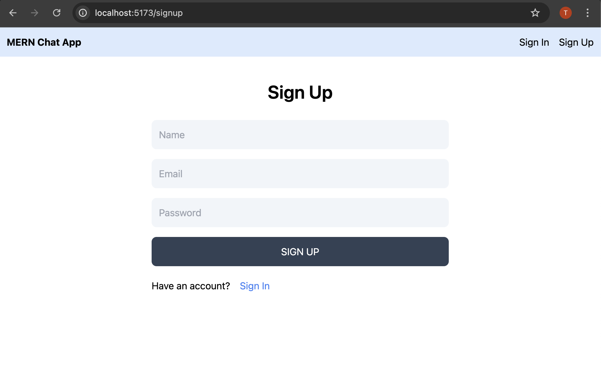
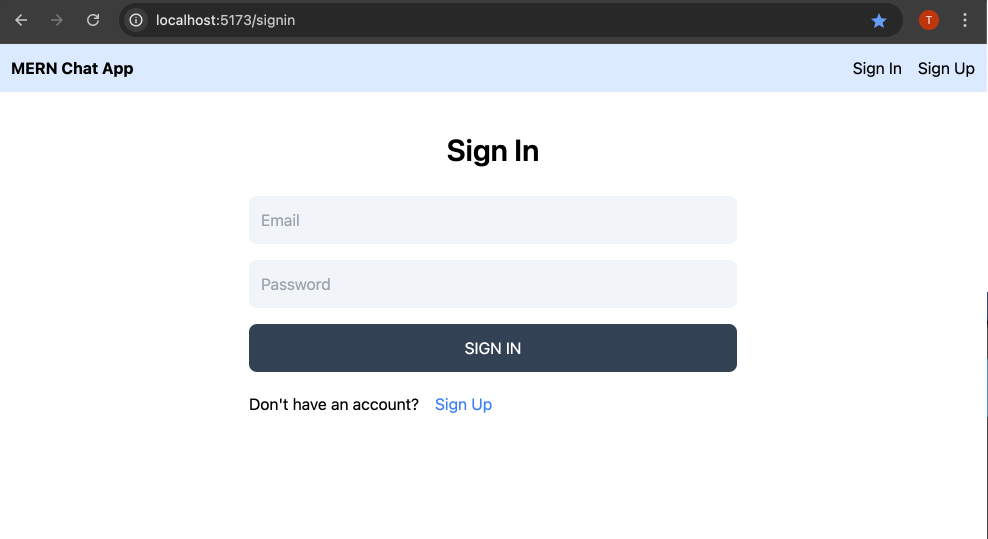
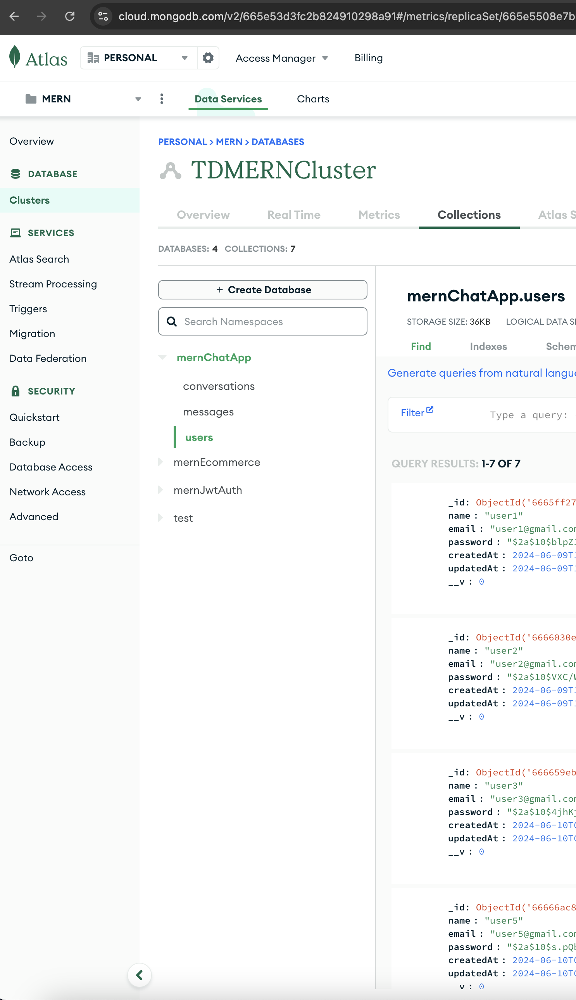
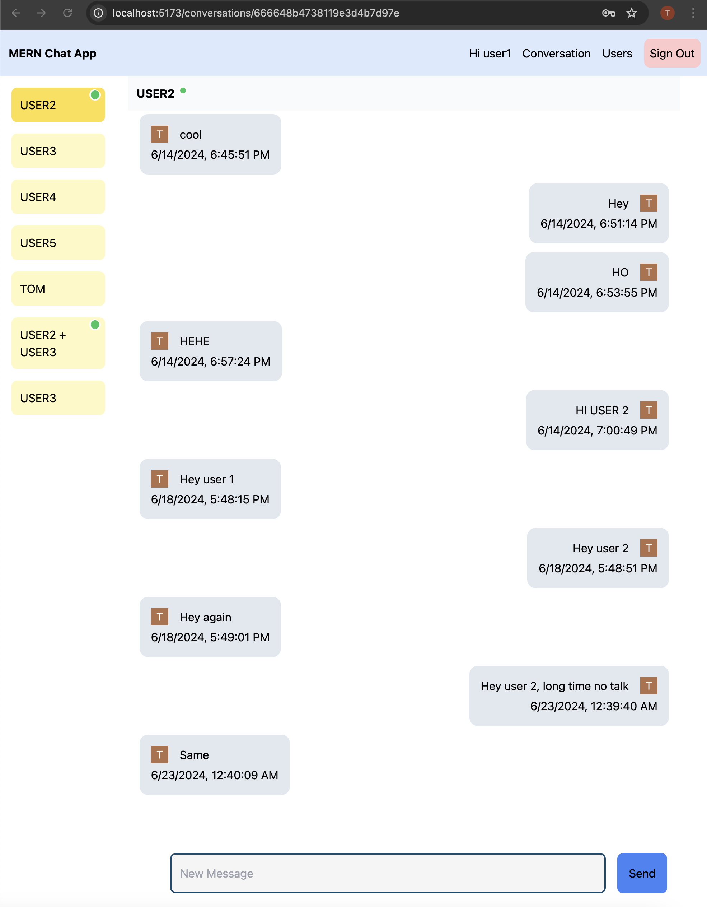
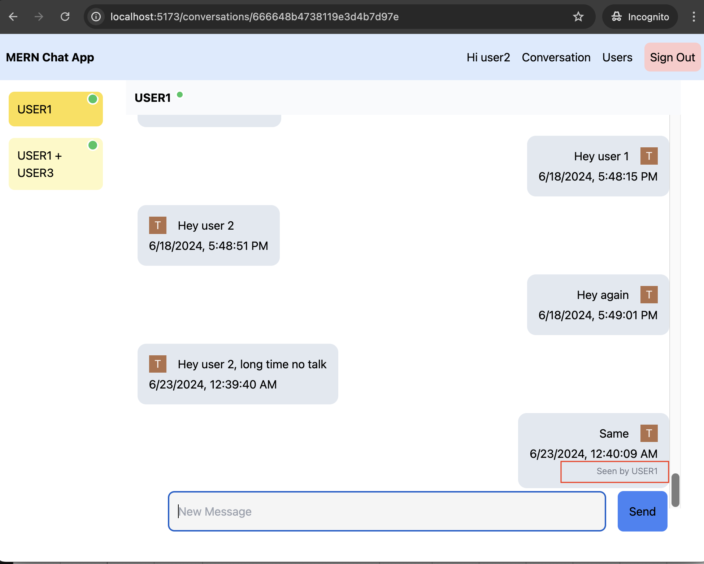
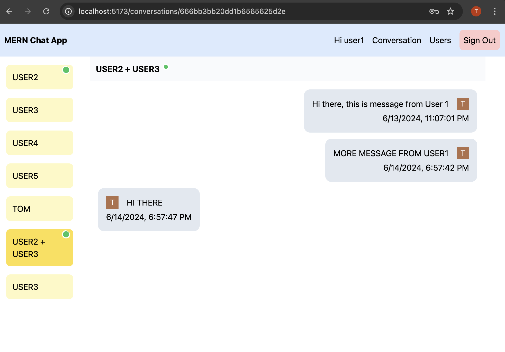
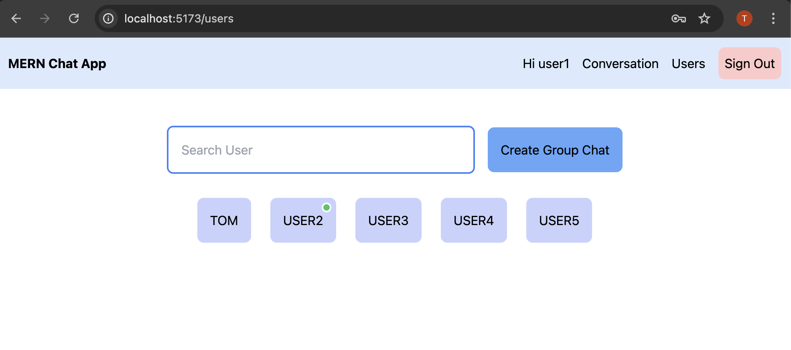
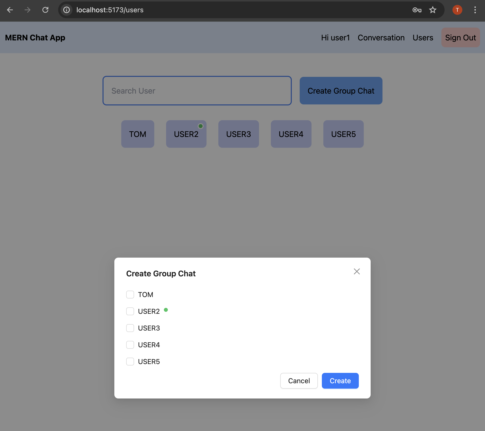

[Live](https://mern-chat-app-client-ten.vercel.app)

# Set up
- Install [Node](https://nodejs.org/en/download/)
- Install [Git](https://git-scm.com/book/en/v2/Getting-Started-Installing-Git)
- Setup MongoDB
- Clone the repository `https://github.com/tddag/MERN_Chat_App`
- Install dependencies `npm install`
- Set up (Pusher)[https://dashboard.pusher.com/]
    - Create a new Channel
    - Navigate to App Keys to obtain app_id, key, secret then use it to set up server environment variables
- Set up server enviroment variables (./server/.env):
  - <table>
        <tr>
            <th>Variable</th>
            <th>Value</th>
            <th>Description</th>
        </tr>
        <tr>
            <td>MONGO_URL</td>
            <td>mongodb+srv://.....</td>
            <td>MongoDB Server URL</td>
        </tr>
        <tr>
            <td>JWT_PRIVATE_KEY</td>
            <td>......</td>
            <td>JWT private key to sign/verify payload</td>
        </tr>       
        <tr>
            <td>PUSHER_APP_ID</td>
            <td>123....</td>
            <td>Pusher App ID</td>
        </tr>       
        <tr>
            <td>PUSHER_PUBLIC_APP_KEY</td>
            <td>74e57......</td>
            <td>Pusher Public App Key</td>
        </tr>       
        <tr>
            <td>PUSHER_APP_SECRET</td>
            <td>f5c640</td>
            <td>Pusher App Secret</td>
        </tr>                         
            
    </table>
- Set up client enviroment variables (./client/.env):
  - <table>
        <tr>
            <th>Variable</th>
            <th>Value</th>
            <th>Description</th>
        </tr>
        <tr>
            <td>VITE_SERVER_URL</td>
            <td>http://localhost:8000</td>
            <td>Server URL</td>
        </tr>   
        <tr>
            <td>VITE_PUBLIC_PUSHER_APP_KEY</td>
            <td>74e57a....</td>
            <td>Pusher App Key</td>
        </tr>                  
    </table>
- Run the app `npm run start`

# Functionalities
- User Authentication
  - <table>
        <tr>
            <td></td>
            <td></td>
            <td></td>
        </tr>
    </table>
- Real time messages, active users, seen receipt
  - <table>
        <tr>
            <td></td>
            <td></td>
        </tr>
    </table>   
-  Group messaging 
  - <table>
        <tr>
            <td></td>
        </tr>
    </table>  
-  User Listing, Search User, Create Group Chat
  - <table>
        <tr>
            <td></td>
            <td></td>
        </tr>
    </table>      

# Technologies/Libraries
- ExpressJS: backend server
- ReactJS: web app
- Mongoose: ODM (Object Data Modeling)
- MongoDB: database
- Pusher: real-time API
- JsonWebToken: Authentication
- Bcryptjs: Hashing password
- AntDesign: React Components
- ReactRedux: State management
- ReactRouterDOM: React routes
- ReduxPersist: Persist and Rehydrate Redux store, localStorage
